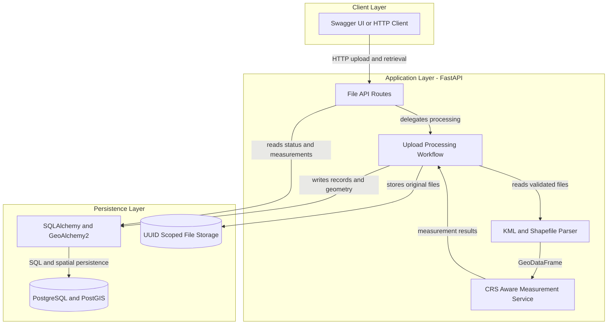
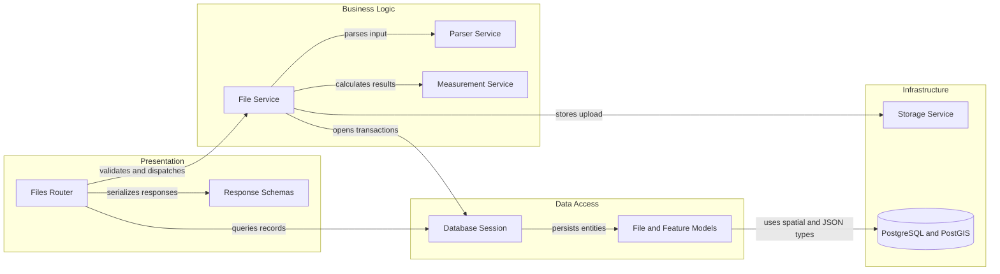

# Architecture Diagram

This document describes the runtime architecture and the main component boundaries of the geospatial measurement API. The design is intentionally synchronous: an upload is validated, parsed, measured, and persisted before the upload request completes.

## Application Architecture

<!-- mermaid-checked: no \n, no em-dash/en-dash, no {} in labels, subgraphs are id["label"], arrows are -->|"label"|, all subgraphs closed by end, ids unique -->

### Technology Stack Summary

| Layer | Technology | Version | Purpose |
|---|---|---:|---|
| API | FastAPI | 0.115.6 | Defines typed HTTP endpoints and OpenAPI documentation |
| Runtime | Uvicorn | 0.34.0 | Serves the application on port 8000 |
| Geospatial processing | GeoPandas, Shapely, PyProj | 1.0.1, 2.0.7, 3.7.0 | Reads features, transforms CRS, and calculates measurements |
| Persistence | SQLAlchemy, GeoAlchemy2 | 2.0.37, 0.17.1 | Maps application records to PostgreSQL/PostGIS |
| Database | PostgreSQL with PostGIS | 16, 3.4 | Stores file metadata, JSON properties, and spatial geometry |
| Packaging | Docker Compose | - | Runs the API and database as one reproducible environment |

### Data Storage and External Services

The system uses PostgreSQL/PostGIS as its only external service. File metadata and feature measurements are stored in relational tables, while feature properties and normalized GeoJSON are stored as JSONB. Original uploads are stored in UUID-scoped application storage, and normalized feature geometries are stored in PostGIS with EPSG:4326 and a spatial index. No third-party API, cache, message broker, or cloud storage service is required.

### Key Architectural Decisions

- Measurement uses a local projected UTM CRS instead of calculating area or length directly in longitude and latitude degrees.
- Route handlers remain thin; parsing, storage, measurement, and persistence are separated into focused services.
- Processing failures are persisted with a `FAILED` status and diagnostic message so clients can inspect the failed upload.

## Component Relationships

<!-- mermaid-checked: no \n, no em-dash/en-dash, no {} in labels, subgraphs are id["label"], arrows are -->|"label"|, all subgraphs closed by end, ids unique -->

### Component Inventory

| Component | Layer | Type | Responsibility |
|---|---|---|---|
| `app/api/files.py` | Presentation | Router | Exposes upload, file status, and measurement endpoints |
| `app/schemas.py` | Presentation | DTO schemas | Defines validated public response shapes |
| `app/services/file_service.py` | Business Logic | Application service | Coordinates the complete upload lifecycle and status transitions |
| `app/services/parser.py` | Business Logic | Parser | Reads KML and validates and reads zipped Shapefiles |
| `app/services/measurement.py` | Business Logic | Domain service | Reprojects geometries and calculates JSON-safe measurements |
| `app/db.py` | Data Access | Session and configuration | Creates SQLAlchemy sessions and initializes the database |
| `app/models.py` | Data Access | ORM models | Maps files and features to relational and spatial persistence |
| `app/services/storage.py` | Infrastructure | Storage service | Streams uploads, enforces limits, extracts archives safely, and cleans up |
| PostgreSQL/PostGIS | Infrastructure | Database | Persists metadata, measurements, properties, and geometry |
